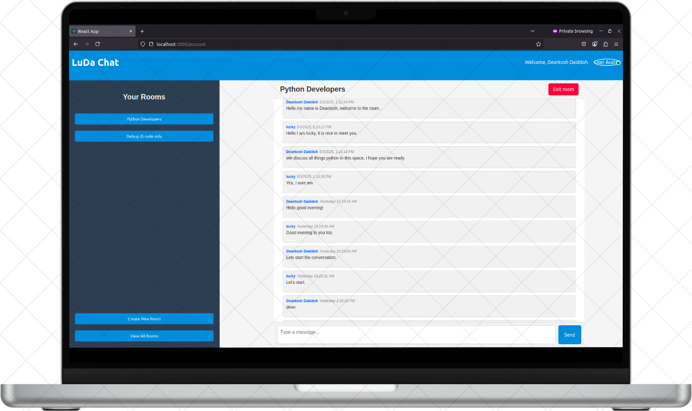

# LuDa Chat App

**LuDa Chat App** is a full-stack real-time chat application designed for seamless communication. It enables users to create accounts, log in, and exchange messages instantly via WebSocket technology. Built using modern JavaScript tools, the app includes both a web-based frontend and a robust backend server.

---

## 🚀 Features

- 🧑‍💻 User authentication (registration & login)
- 💬 Real-time chat using WebSockets
- 🗄️ MongoDB for message and user data storage
- 🔐 Session management with Redis
- 🖥️ Responsive, modern web interface

---

## 🛠️ Tech Stack

| Layer      | Technology                    |
|------------|-------------------------------|
| Frontend   | React, Axios, WebSocket API   |
| Backend    | Node.js, Express, Socket.IO   |
| Database   | MongoDB (via Mongoose)        |
| Cache      | Redis (session storage)       |
| Dev Tools  | dotenv, nodemon, ESLint       |

---

## 📁 Project Structure

```
LuDa-Chat-App/
├── client/          # Frontend application (React)
├── server/          # Backend application (Node.js/Express)
├── README.md        # Project documentation
├── LICENSE          # MIT License
```

---

## ✅ Prerequisites

Make sure you have the following installed on your system:

- [Node.js](https://nodejs.org/) (v14+ recommended)
- [npm](https://www.npmjs.com/)
- [MongoDB](https://www.mongodb.com/)
- [Redis](https://redis.io/)
- A WebSocket-compatible browser

---

## ⚙️ Installation

### 📦 Client Setup

1. Navigate to the client directory:

   ```bash
   cd client
   ```

2. Install dependencies:

   ```bash
   npm install
   ```

3. (Optional) Create a `.env` file:

   ```bash
   cp .env.example .env
   ```

   Update the variables according to your environment.

4. Start the development server:

   ```bash
   npm start
   ```

   Access the client at [http://localhost:3000](http://localhost:3000)

---

### 🖥️ Server Setup

1. Navigate to the server directory:

   ```bash
   cd server
   ```

2. Install dependencies:

   ```bash
   npm install
   ```

3. Configure the environment:

   ```bash
   cp .env.example .env
   ```

   Update the following variables in `.env`:
   - `PORT`
   - `MONGO_URI`
   - `SESSION_SECRET`
   - `REDIS_HOST`
   - `REDIS_PORT`

4. Start the server:

   ```bash
   npm start
   ```

   The backend will run on [http://localhost:5000](http://localhost:5000) by default.

---

## 🧪 Running Tests

To run unit tests:

```bash
npm test
```

---

## 🔌 API & WebSocket Usage

### API Endpoints - LuDa Chat App

This document outlines all the RESTful API routes available in the LuDa Chat App. Each route is categorized by functionality: App Status, User Management, Authentication, Messaging, and Room Management.

---

**🛩️ App Status**

| Method | Endpoint     | Description      |
|--------|--------------|------------------|
| GET    | `/status`    | Check API status |

---

**👤 User Management**

| Method | Endpoint              | Description           |
|--------|-----------------------|-----------------------|
| POST   | `/users/register`     | Register a new user   |
| GET    | `/users/me`           | Get current user info |
| PUT    | `/users/update`       | Update user info      |
| GET    | `/users/dashboard`    | Get dashboard summary |

---

**🔐 Authentication**

| Method | Endpoint           | Description       |
|--------|--------------------|-------------------|
| POST   | `/users/login`     | Log in a user     |
| DELETE | `/users/logout`    | Log out the user  |

---

**💬 Messaging**

| Method | Endpoint                                                                  | Description               |
|--------|---------------------------------------------------------------------------|---------------------------|
| POST   | `/rooms/:room_id/messages`                                                | Send a new message        |
| GET    | `/rooms/:room_id/messages`                                                | Get all messages in room  |
| POST   | `/rooms/:room_id/messages/:message_id/replies`                            | Reply to a specific message |
| GET    | `/messages/:message_id/replies`                                           | Get replies for a message |
| POST   | `/rooms/:room_id/messages/:message_id/reactions`                          | React to a message        |

---

**🏠 Room Management**

| Method | Endpoint                                     | Description          |
|--------|----------------------------------------------|----------------------|
| POST   | `/rooms`                                     | Create a new room    |
| GET    | `/rooms`                                     | Get list of all rooms|
| GET    | `/rooms/:room_id`                            | Get details of a room|
| POST   | `/rooms/:room_id/users/:user_id/join`        | Join a room          |
| DELETE | `/rooms/:room_id/users/:user_id/exit`        | Exit a room          |

---

All endpoints are secured and require proper authentication headers unless noted otherwise. Please refer to the main documentation or API reference for sample requests and response formats.

### WebSocket Events
- `connect` – Establish a connection
- `message` – Send/receive chat messages
- `disconnect` – Handle user disconnect

---

## 🌐 Running the Application

Once both client and server are running:

- Open your browser and visit [http://localhost:3000](http://localhost:3000)
- The client should be able to connect and chat in real time.

Ensure CORS settings and WebSocket URLs are correctly configured if hosting separately.

---

## 🙋 Contributing

We welcome contributions! To get started:

1. Fork this repository
2. Create a new branch:
   ```bash
   git checkout -b feature/your-feature-name
   ```
3. Commit and push your changes:
   ```bash
   git commit -m "Add feature"
   git push origin feature/your-feature-name
   ```
4. Submit a pull request

Please review our [Code of Conduct](CODE_OF_CONDUCT.md) and open issues before contributing.

---

## 📄 License

This project is licensed under the MIT License. See the [LICENSE](LICENSE) file for details.

---

## 📷 Screenshots



---

## 🧠 Future Improvements

- Private chat rooms
- Chat history search
- Push notifications
- File sharing